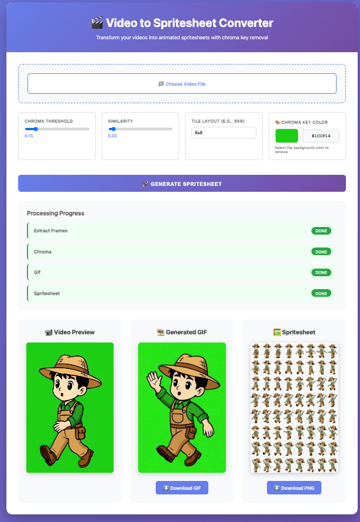

# 🎬 Video to Spritesheet Converter

A powerful web application that converts videos into animated spritesheets with chroma key (green screen) removal. Perfect for game development, animation workflows, and sprite generation from AI-generated videos.





## ✨ Features

- **Video Upload**: Upload MP4 video files through an intuitive web interface
- **Frame Extraction**: Automatically extracts frames from video at configurable frame rates
- **Chroma Key Removal**: Removes green screen backgrounds using advanced chroma key filtering
- **GIF Generation**: Creates optimized animated GIFs from processed frames
- **Spritesheet Creation**: Generates sprite sheets with customizable tile layouts (e.g., 8x8, 6x2)
- **Real-time Progress**: Live progress tracking with visual status indicators
- **Modern UI**: Beautiful, responsive design with smooth animations

## 🚀 Quick Start

### Prerequisites

- **Go 1.23+**: [Download Go](https://golang.org/dl/)
- **FFmpeg**: Required for video processing
  - macOS: `brew install ffmpeg`
  - Ubuntu/Debian: `sudo apt-get install ffmpeg`
  - Windows: [Download FFmpeg](https://ffmpeg.org/download.html)

### Installation

1. **Clone the repository**
   ```bash
   git clone <repository-url>
   cd video2spritesheet
   ```

2. **Install dependencies**
   ```bash
   go mod download
   ```

3. **Run the server**
   ```bash
   go run cmd/server/main.go
   ```

4. **Open your browser**
   Navigate to `http://localhost:8080`

## 📖 Usage

### Basic Workflow

1. **Upload Video**: Click "Choose Video File" and select your MP4 video
2. **Configure Settings**:
   - **Chroma Threshold**: Adjust sensitivity for green screen detection (0.0 - 1.0)
   - **Similarity**: Fine-tune color matching (0.0 - 1.0)
   - **Tile Layout**: Set spritesheet grid (e.g., `8x8`, `6x2`, `4x4`)
3. **Generate**: Click "Generate Spritesheet" and watch the progress
4. **Download**: Once complete, download your GIF and PNG spritesheet

### Processing Steps

The application processes videos through four main steps:

1. **Extract Frames**: Extracts frames from video at 12 FPS
2. **Chroma Processing**: Removes green screen backgrounds from each frame
3. **GIF Creation**: Generates an animated GIF (320px width, 12 FPS)
4. **Spritesheet Generation**: Creates a tiled spritesheet image

## 🏗️ Architecture

### Project Structure

```
video2spritesheet/
├── cmd/
│   └── server/
│       └── main.go          # HTTP server entry point
├── internal/
│   ├── api/
│   │   ├── upload.go         # Video upload handler
│   │   └── process.go        # Video processing handler
│   ├── ffmpeg/
│   │   ├── runner.go         # FFmpeg command execution
│   │   ├── extract.go        # Frame extraction
│   │   ├── chroma.go         # Chroma key removal
│   │   ├── gif.go            # GIF generation
│   │   └── sprite.go         # Spritesheet creation
│   ├── jobs/
│   │   ├── job.go            # Job management
│   │   ├── status.go         # Status tracking
│   │   └── store.go          # Job storage
│   └── validation/
│       └── video.go          # Video validation
├── web/
│   ├── index.html            # Frontend HTML
│   └── app.js                # Frontend JavaScript
├── outputs/                  # Generated files (created at runtime)
└── README.md
```

### API Endpoints

- `POST /api/upload` - Upload a video file
  - Request: `multipart/form-data` with `video` field
  - Response: `{ "job_id": "...", "preview": "..." }`

- `POST /api/process` - Process uploaded video
  - Request: `{ "job_id": "...", "threshold": 0.15, "similarity": 0.05, "tile": "8x8" }`
  - Response: Job status object

- `GET /outputs/{job_id}/status.json` - Get processing status
  - Response: `{ "jobId": "...", "currentStep": "...", "steps": [...], "outputs": {...} }`

- `GET /outputs/{job_id}/*` - Access generated files

## 🛠️ Development

### Building

```bash
go build -o video2spritesheet cmd/server/main.go
```

### Running Tests

```bash
go test ./...
```

### Cleaning Outputs

```bash
./scripts/clear-outputs.sh
```

## ⚙️ Configuration

### Environment Variables

Currently, the application uses default settings. You can modify:

- **Port**: Change `:8080` in `cmd/server/main.go`
- **Frame Rate**: Modify `fps=12` in `internal/ffmpeg/extract.go`
- **GIF Scale**: Adjust `scale=320:-1` in `internal/ffmpeg/gif.go`
- **Chroma Key Color**: Change `0x00ff00` in `internal/ffmpeg/chroma.go`

## 📝 Example

### Input
- Video file with green screen background
- Settings: Threshold 0.15, Similarity 0.05, Tile 8x8

### Output
- **GIF**: Animated GIF with transparent background
- **Spritesheet**: PNG image with frames arranged in 8x8 grid

## 🔧 Troubleshooting

### FFmpeg Not Found
```
Error: exec: "ffmpeg": executable file not found
```
**Solution**: Install FFmpeg and ensure it's in your PATH

### Port Already in Use
```
Error: listen tcp :8080: bind: address already in use
```
**Solution**: Change the port in `cmd/server/main.go` or stop the process using port 8080

### Video Upload Fails
- Ensure video is in MP4 format
- Check file size (default limit: 1GB)
- Verify video file is not corrupted

### Processing Errors
- Check FFmpeg installation
- Verify video file format
- Review server logs for detailed error messages

## 📄 License

See [LICENSE](LICENSE) file for details.

## 🤝 Contributing

Contributions are welcome! Please feel free to submit a Pull Request.

1. Fork the repository
2. Create your feature branch (`git checkout -b feature/AmazingFeature`)
3. Commit your changes (`git commit -m 'Add some AmazingFeature'`)
4. Push to the branch (`git push origin feature/AmazingFeature`)
5. Open a Pull Request

## 📧 Support

For issues, questions, or contributions, please open an issue on GitHub.

## 🎯 Roadmap

- [ ] Support for multiple video formats (WebM, MOV, etc.)
- [x] Custom chroma key color selection
- [ ] Batch processing
- [ ] Video preview with frame selection
- [ ] Export options (different image formats, quality settings)
- [ ] User authentication and job history
- [ ] Docker containerization

---

**Made with ❤️ for game developers and animators**
